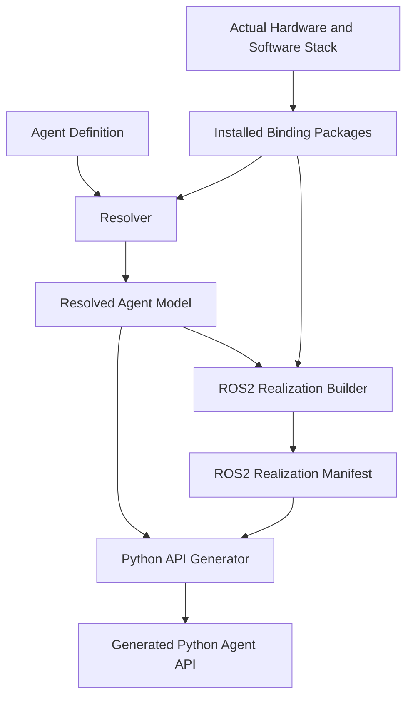
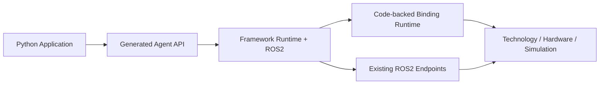

# Prototype v0 Implementation Handoff

> [!important] Coding-agent instruction
> The coding workspace root is `project/`. Open the complete workspace, not only `agent-framework`. This is a production-grade robotics framework. Read the architecture and design documents before coding. Implement only the active milestone. Do not silently redesign concepts or introduce new primitives.
>
> The implementation baseline is `0.1.0`. Do not change any project or interface version unless the project owner explicitly requests it.

## 1. Objective

Build a framework in which a developer writes one **Agent Definition**, selects and configures reusable bindings, and lets the framework resolve the Agent, construct its ROS2 realization, and then generate the Python-facing Agent API.

The application must never need PX4, sensor-driver, ROS2 endpoint, QoS, or binding-specific knowledge.

Prototype v0 uses ROS2 as the communication layer and targets source-code independence from ROS2. Full deployment independence is deferred, but the API boundary must remain replaceable.

## 2. Workspace

All source and project context live under one grand workspace:

```text
project/
├── agent-framework/
├── bindings/
├── agents/
├── deployments/
├── build/
├── tests/
├── docker/
└── docs/
```

The full authoritative tree is defined in `docs/design/Environment and Repository.md`.

Bindings are peer packages in the workspace, not subpackages of `agent-framework`. Each binding remains independently installable and can later move to a separate repository without changing framework behavior.

## 3. Authoritative Build Flow



The flow is intentionally linear. The Python API is generated only after ROS2 realization is known.

## 4. Runtime Principle

A binding runtime component is **not** mandatory for every communication path.



A direct binding may use an existing ROS2 endpoint without inserting a generic republisher or binding process. A code-backed binding runtime is used only when sequencing, conversion, state management, liveness, or other executable integration logic is required.

## 5. Locked Model Decisions

- There are exactly two primitives: **Property** and **Capability**.
- **Property** describes information about the Agent itself or one of its components.
- **Capability** describes a function the Agent performs. Sensing and perception functions are Capabilities.
- Sensor outputs such as LiDAR point clouds, images, scans, and radar returns are outputs of sensing Capabilities, not Properties and not a third primitive.
- **Channel** is one unidirectional logical communication flow.
- A Capability may have input, output, acknowledgement, feedback, result, cancellation, liveness, and status Channels as needed.
- **Group** may contain any mixture of Properties, Capabilities, and nested Groups.
- **Constraint** carries machine-readable physical, software, and valid-use limitations.
- Bindings own technology-specific realization knowledge, including ROS2 mappings for the functionality they provide.
- The Agent Definition is the single developer-authored source for Agent semantics, binding selection, configuration, grouping, constraints, and optional ROS2 overrides.
- Existing ROS2 interfaces are reused when suitable. Duplicate generic ROS endpoints are not created merely for abstraction.
- Binding packages are independent distributions, even when their source lives under `project/bindings/` during development.
- No Pydantic is used.
- Build-time parsing, discovery, resolution, and validation never run in the per-message runtime hot path.
- Multiple instances of one Agent Definition and multiple different Agent Definitions are supported.
- Docker is the canonical development and integration environment.

## 6. Read Order

From `project/`:

1. `docs/IMPLEMENTATION_READINESS.md`
2. `docs/architecture/Agent Definition Model.md`
3. `docs/architecture/System Architecture and Design Decisions.md`
4. `docs/design/Environment and Repository.md`
5. `docs/design/Core Model.md`
6. `docs/design/Agent Definition and Resolution.md`
7. `docs/design/Binding Model.md`
8. `docs/design/ROS2 Realization.md`
9. `docs/design/Python API Runtime and Deployment.md`
10. Only the active milestone under `docs/milestones/`

## 7. Milestones

| Milestone | Outcome |
|---|---|
| `M0` | `project/` workspace, reproducible Docker environment, framework skeleton |
| `M1` | Core model and validation |
| `M2` | External Binding API, test binding package, Agent Definition parsing, resolution |
| `M3` | ROS2 realization builder and manifest |
| `M4` | Python API generation and ROS2 runtime using the test binding |
| `M5` | Real `bindings/px4` package |
| `M6` | Multi-agent deployment |
| `M7` | Independent sensor Capability binding and supervisor demo |

Do not attempt all milestones in one pass.
