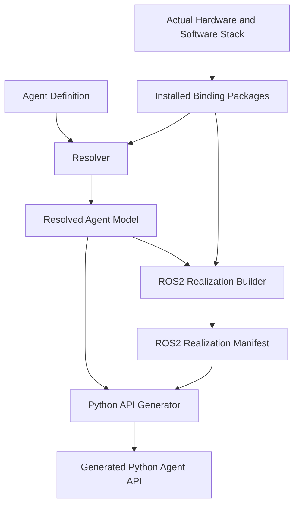
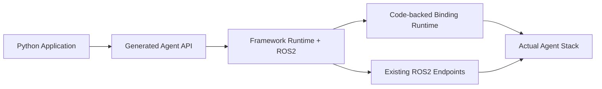
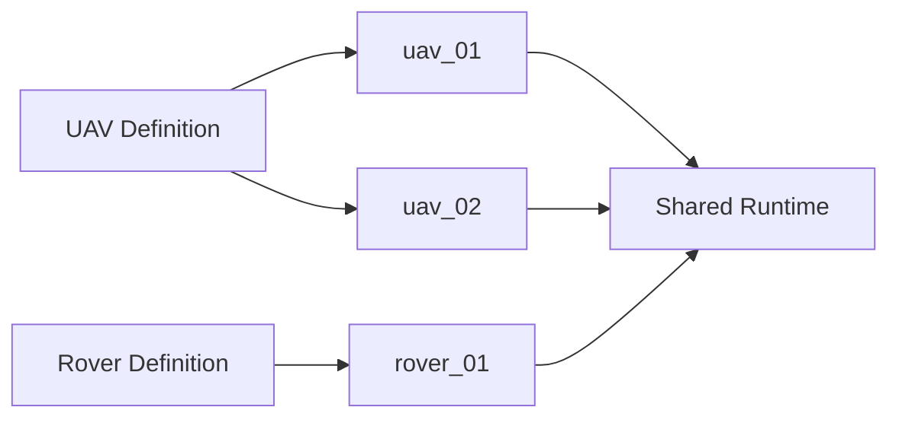

# System Architecture and Design Decisions

## 1. Objective

The developer should describe an Agent once, select the bindings needed to realize it, and optionally override ROS2 realization details when necessary. The framework performs the remaining translation automatically.

The architecture is intentionally **linear** because each later stage has more concrete information than the previous stage.

## 2. Development Architecture

The Python API is **not** generated directly from the Agent Definition. It is generated after ROS2 realization is finalized so the generator knows both the Agent semantics and the exact communication realization.

## 2.1 Development Workspace

The canonical coding context is one top-level `project/` workspace containing the framework distribution, locally developed binding distributions, Agent Definitions, Deployment Specifications, generated artifacts, Docker environment, system tests, and architecture/design documentation. Technology-specific bindings remain independently installable packages even when their source is developed under `project/bindings/`.

## 3. Stage Responsibilities

### 3.1 Actual Hardware and Software Stack

The real Agent may combine:

- physical hardware,
- actuators,
- sensors,
- PX4, ArduPilot, robot controllers, or other software,
- simulation systems,
- custom software components.

This determines what can actually be implemented.

### 3.2 Binding Packages

Bindings are independently distributable packages that know:

1. what generic Properties and Capabilities they can provide,
2. mandatory requirements and supported configuration,
3. how those elements map to ROS2,
4. how to communicate with the underlying technology,
5. runtime logic required for sequencing, conversion, state machines, liveness, or other technology-specific behavior.

Bindings are modular. Adding one new PX4 capability or one new sensor function must not require redesigning unrelated bindings or framework core code.

### 3.3 Agent Definition

The Agent Definition is the primary developer-authored source.

The developer writes Agent semantics once and references installed bindings rather than repeating binding knowledge.

The definition selects and configures:

- functionality to expose,
- Agent-facing names,
- binding configuration,
- Groups,
- Constraints,
- developer-owned responsibilities,
- optional ROS2 overrides when defaults are not suitable.

A developer does not repeat endpoint names, message types, QoS defaults, or technology sequencing that the binding already declares.

### 3.4 Resolver

The Resolver combines the Agent Definition with binding-provided definitions.

It validates:

- referenced bindings exist,
- binding API compatibility,
- requested functionality can be realized,
- mandatory requirements are not weakened,
- schemas and Channels are consistent,
- Groups and Constraints reference valid targets,
- configuration is valid,
- Agent-facing names do not conflict.

Its output is the **Resolved Agent Model**.

### 3.5 Resolved Agent Model

The Resolved Agent Model is the final technology-neutral semantic description of the Agent.

It contains:

- Properties,
- Capabilities,
- consumer-visible Channels,
- schemas,
- Constraints,
- Groups,
- ownership of consumer-visible responsibilities.

It does not contain PX4 message names or raw binding implementation details.

### 3.6 ROS2 Realization Builder

The ROS2 Realization Builder receives the Resolved Agent Model plus binding ROS2 descriptions and optional Agent Definition overrides.

It determines the final ROS2 realization:

- reused topics, services, and actions,
- generated interfaces only when required,
- endpoint names/templates,
- message/service/action types,
- QoS,
- Channel-to-ROS mappings,
- binding runtime requirements,
- namespace and instance templates,
- adapters/conversions required at runtime.

The result is the **ROS2 Realization Manifest**.

### 3.7 Python API Generator

The Python API Generator consumes both:

- the Resolved Agent Model, for semantic meaning,
- the ROS2 Realization Manifest, for exact communication details.

It generates the application-facing interface only after the ROS2 layer is known.

Application code sees Agent concepts and generated Python types, not PX4 messages, ROS2 endpoint names, QoS objects, or sensor-driver types.

## 4. Runtime Architecture

The shortest valid runtime path should be used. A binding runtime component is optional and exists only when executable integration logic is required. Direct bindings may connect the framework runtime directly to existing ROS2 endpoints. Do not add generic republishing or adapter hops merely to preserve conceptual layers.

## 5. Binding-controlled ROS2 Realization

The framework knows how to construct and operate ROS2 resources, but it does not infer how a technology should be controlled.

A binding defines the required ROS2 mapping and technology logic. The framework validates and materializes that mapping.

This division prevents the framework from recreating PX4, sensor-driver, or vendor-specific knowledge.

## 6. Existing ROS2 Interfaces

- Reuse standard or technology-provided ROS2 interfaces whenever they correctly represent the required communication.
- Do not create duplicate generic ROS2 topics merely to rename existing endpoints.
- Generate custom `.msg`, `.srv`, or `.action` interfaces only when no suitable existing interface can represent the required realization.
- Optional ROS2 overrides are allowed in the Agent Definition, but defaults and mandatory requirements come from bindings.

## 7. Agent Definition and Agent Instance

An **Agent Definition** is reusable.

An **Agent Instance** is one runtime instance of that definition.

Instance-specific information may include:

- runtime ID,
- ROS namespace,
- device address,
- PX4 instance identifier,
- binding instance parameters,
- endpoint template substitutions.

One definition may create many instances, and one deployment may contain heterogeneous definitions.

## 8. Deployment

A separate Deployment Specification contains runtime instance configuration only. It does not repeat Agent semantics.

The runtime should share ROS2 context/executor infrastructure where safe rather than creating a complete independent communication stack per Agent instance.

## 9. Source-code Independence

Prototype v0 requires application source code to be independent of ROS2.

Application code must not import or depend directly on:

- `rclpy`,
- ROS2 message/service/action classes,
- `px4_msgs`,
- sensor-driver message classes,
- topic/service/action names,
- ROS2 QoS configuration.

ROS2 may still be installed on the application machine in Prototype v0. Full deployment independence is deferred.

## 10. Build-time and Runtime Separation

Development/build time may perform:

- YAML parsing,
- binding discovery,
- validation,
- resolution,
- ROS2 realization planning,
- code/interface generation,
- deterministic artifact generation.

The per-message runtime path must not perform:

- YAML parsing,
- package discovery,
- general schema resolution,
- code generation,
- reflective framework validation,
- Pydantic validation.

## 11. Latency and Data-path Principle

Logical abstractions must not force physical middleware hops.

Bindings and runtime components may share subscriptions, co-locate transformations, and directly consume native endpoints when this preserves semantics and reduces copies.

Performance claims must be measured. High-bandwidth sensor Capability outputs must be designed to avoid unnecessary serialization and copying.

## 12. Versioning

Prototype v0.1.0 uses semantic `MAJOR.MINOR.PATCH` versioning for:

- framework package,
- binding API,
- Agent Definition schema,
- Deployment schema,
- generated artifact schemas,
- external binding packages.

The current project baseline is `0.1.0`. Documentation or architecture edits do not automatically change this version. Versions must not be incremented unless the project owner explicitly requests a version change as part of implementation progress.

