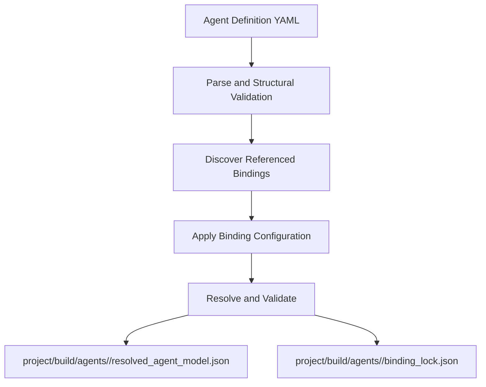

# Agent Definition and Resolution

## 1. Authoring Principle

The developer should describe the Agent **once**.

The Agent Definition references reusable bindings and provides only information that is specific to this Agent configuration or intentionally overrides binding defaults.

Do not require the developer to repeat binding-provided ROS2 endpoints, message types, QoS defaults, mandatory timing, or technology sequencing.

## 2. Format

Prototype v0 uses YAML 1.2 as the human-authored Agent Definition format because the definition is declarative configuration, not executable behavior.

Executable transformations, sequencing, state machines, and device logic belong in binding code.

Generated artifacts use deterministic normalized JSON.

## 3. Agent Definition Shape

Prototype v0.1.0 uses the following authoritative top-level Agent Definition structure. Bindings may define the schema of values inside their own `config` blocks, and the ROS2 realization stage validates allowed override values, but the top-level keys and their responsibilities are fixed:

```yaml
schema_version: "0.1.0"

agent:
  id: inspection_uav
  description: Prototype inspection UAV

expose:
  - use: px4.position
    as: position

  - use: px4.offboard.position
    as: position_control
    config:
      liveness_owner: application

  - use: lidar.stream
    as: lidar_stream

groups:
  - id: mobility
    members: [position, position_control]

  - id: lidar
    members: [lidar_stream]

constraints:
  - id: max_speed
    target: position_control
    kind: range
    parameters:
      field: velocity
      max: 5.0

ros2:
  overrides: {}
```

The top-level field grammar and semantics may only be changed through an explicit schema version change requested by the project owner. Implementation code may use any internal dataclass/helper layout that preserves this external schema exactly.

## 4. Hybrid Authoring Rules

A binding provides:

- functionality it can realize,
- default semantic definitions,
- mandatory requirements,
- supported configuration,
- ROS2 mapping defaults,
- runtime implementation requirements.

The Agent Definition may:

- select a binding-provided element,
- rename it for the Agent,
- configure supported binding options,
- group it,
- add stricter compatible Constraints,
- choose application-owned versus binding-owned responsibilities where the binding supports the choice,
- supply allowed ROS2 overrides.

The Agent Definition may not silently weaken mandatory binding requirements.

## 5. Resolution Flow



The Resolver does **not** create the final ROS2 realization. That is the next stage.

## 6. Resolver Responsibilities

1. validate Agent Definition schema version,
2. discover only referenced binding packages,
3. verify binding API compatibility,
4. validate binding configuration,
5. confirm requested binding elements exist,
6. merge binding defaults with Agent-specific choices,
7. prevent weakening mandatory requirements,
8. resolve consumer-visible and internal responsibility ownership,
9. resolve Channel relationships,
10. resolve Group references and reject cycles,
11. resolve Constraint targets,
12. detect naming conflicts,
13. verify binding dependencies,
14. produce deterministic resolved artifacts.

## 7. Resolved Agent Model Artifact

`project/build/agents/<agent-id>/resolved_agent_model.json` contains technology-neutral semantics:

```text
Agent identity
Properties
Capabilities
consumer-visible Channels
PayloadSchemas
Constraints
Groups
responsibility ownership visible to the application
```

It must not contain PX4 message names, ROS2 topic names, ROS2 type names, or runtime Python import paths.

## 8. Binding Lock

`project/build/agents/<agent-id>/binding_lock.json` records reproducibility information such as:

```text
framework version
Agent Definition schema version
Agent Definition content hash
binding package versions
binding API versions
```

ROS2 interface/package versions may be added by the ROS2 realization stage.
